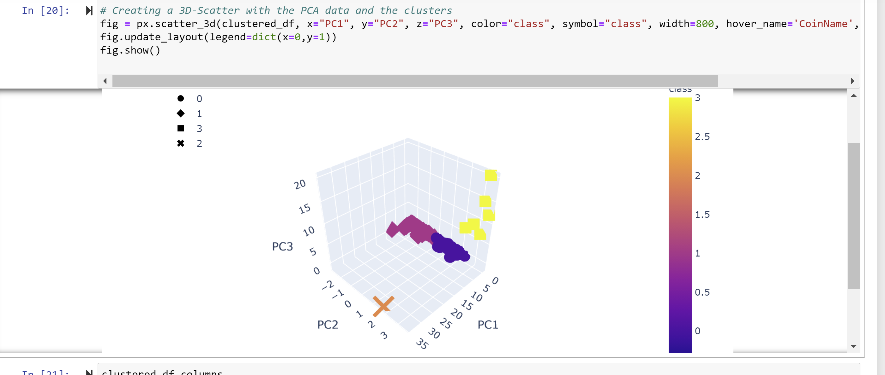
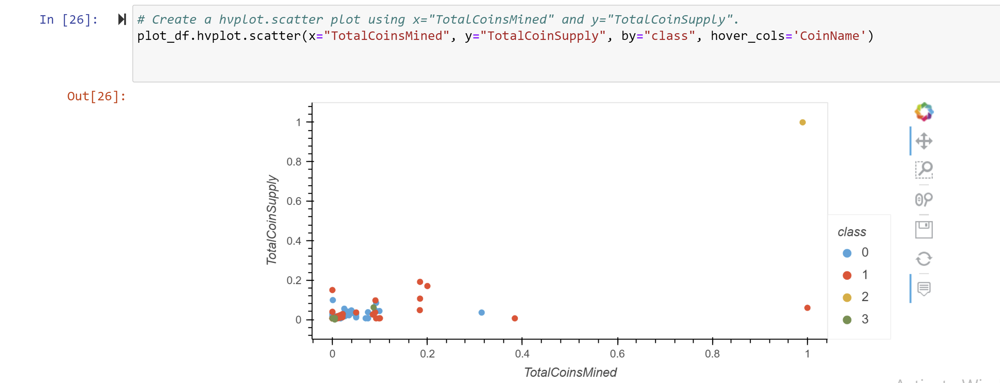

# Cryptocurrencies

Accountability Accounting, a prominent investment bank, was interested in offering a new cryptocurrency investment portfolio for its customers. The company asked for a report that includes what cryptocurrencies are on the trading market and how they could be grouped to create a classification system for this new investment.

The data needed to be processed to fit the machine learning models. Since there was no known output (number of clusters) for what the company was looking for, unsupervised learning was used. To group the cryptocurrencies, KMeans a clustering algorithm was used to group the data into clusters. Based on KMeans, 4 clusters were created. Data visualizations were used to share the findings with Accountability Accounting board.

images of 3D figure and 2D plot of clusters:

